# Liquid Layout with Flexbox and Vanilla JS
## Web Front End Task for open position @ Company X

## PSD to HTML => PSD & .png Design files are in dist > img folder
## Web Front End Task Requirements in requirements.txt

[CodePen](https://codepen.io/ralitsavoronevska/pen/vzvjdw)
| [Live Preview](https://ralitsavoronevska.github.io/liquid-layout/)

# Desktop preview:
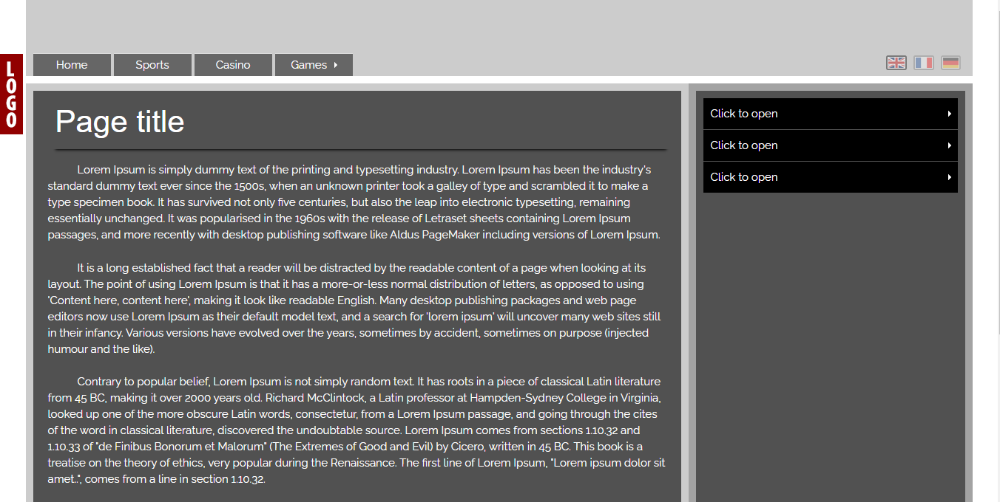
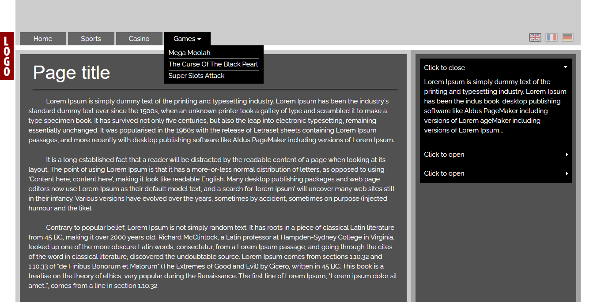

# Tablet preview:
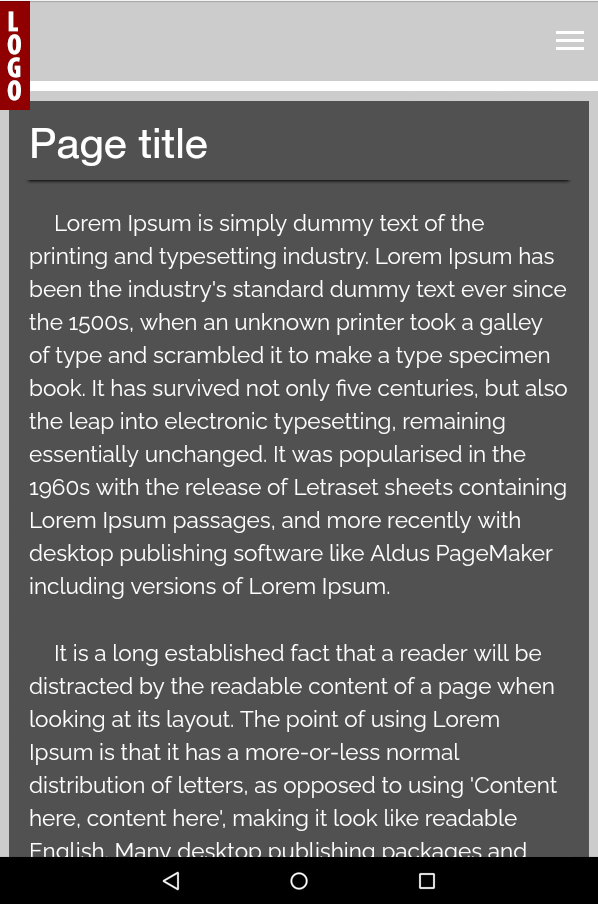
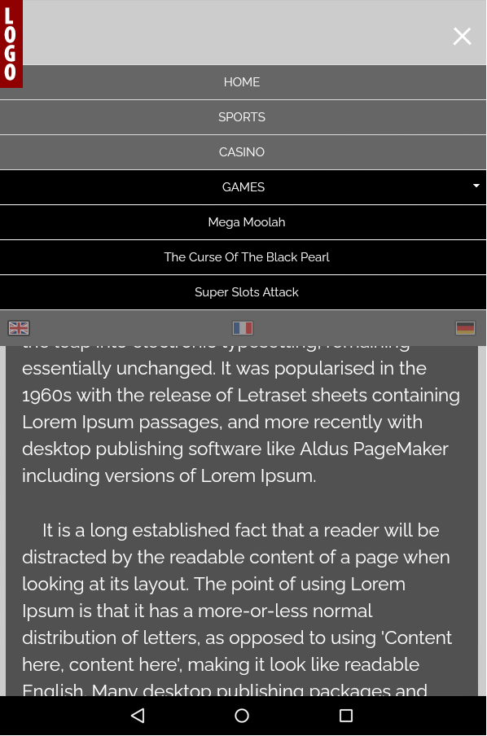

# Mobile preview:

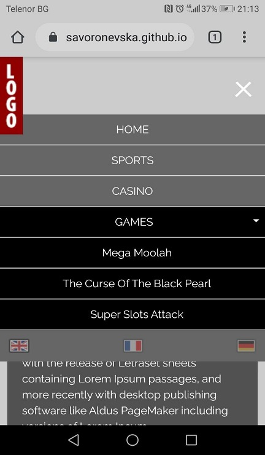

# Built with:
* HTML5, CSS3 [Animations & Flex Layout], Vanilla Javascript

# Browser support:
(Last updated and tested: 21/06/2020)
* Chrome 83.0.4103.106 (Official Build) (64-bit)
* Firefox 77.0.1 (64-bit)
* Opera 68.0.3618.173
* IE Edge 83.0.478.54

# Tools used:
* Photoshop CC 2020
* [Favicon Generator](https://favicon.io/favicon-converter/)
* [Autoprefixer CSS online](https://autoprefixer.github.io/)
* [W3C HTML Validator](https://validator.w3.org/)
* [W3C CSS Validator](https://jigsaw.w3.org/css-validator/)
* [LightHouse Audit](https://developers.google.com/web/tools/lighthouse/)
* [PageSpeed Insights Audit](https://developers.google.com/speed/pagespeed/insights/)

# W3C HTML Validator

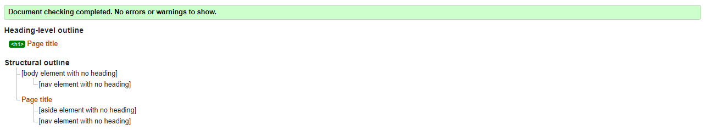

# W3C CSS Validator

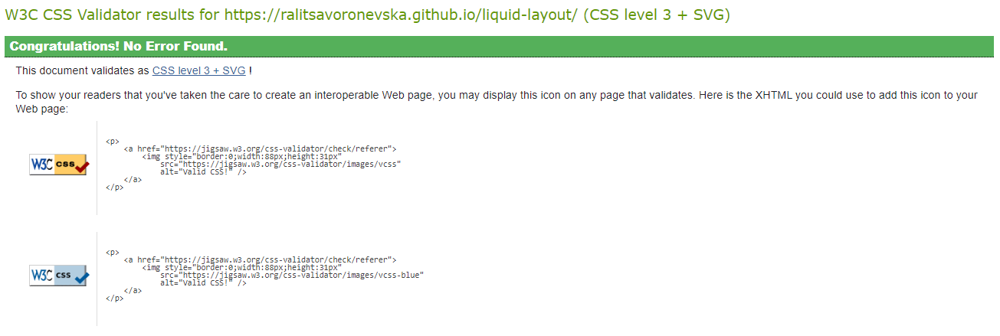

# Chrome LightHouse Audit

* Desktop:
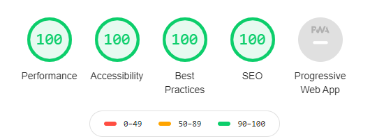

* Mobile:
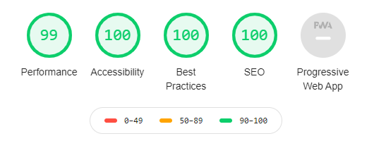

# PageSpeed Insights Results

* Desktop:
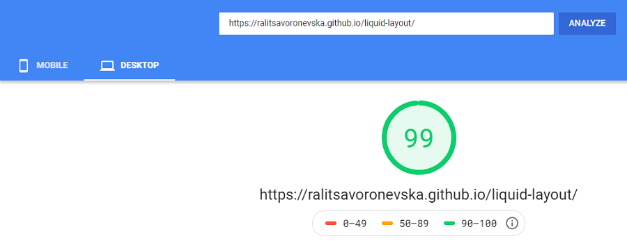

* Mobile:
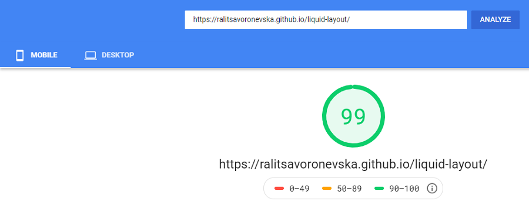
